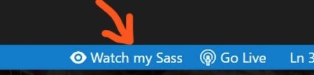

# vsCode插件

## Auto Close Tag

自动添加HTML / XML关闭标签（必备）

## Auto Rename Tag

自动重命名配对的HTML / XML标签(必备)

## Beautify

格式化javascript，JSON，CSS，Sass，和HTML

## Bracket Pair Colorizer

颜色识别匹配括号

## Document This

添加JSDoc注释块，按两次`Ctrl` + `alt` + `d`

## filesize

在底部状态栏显示当前文件大小，点击后还可以看到详细创建、修改时间

## HTML CSS Support

在 html 标签上写class 智能提示当前项目所支持的样式（必备）

## HTML Snippets

html 代码片段（必备）

## htmltagwrap

可以在选中HTML标签中外面套一层标签，选择一大段代码，然后按“`Alt` + `W`”

## Indenticator

突出目前的缩进深度

## JavaScript Snippet Pack

js代码片段（必备）

## JavaScript (ES6) code snippets

es6代码片段（必备）

## Live Sass Compiler

实时编译 sass ,不过需要配置，附上我的配置

```js
"liveSassCompile.settings.formats":[
  // You can add more
  {
    "format": "compressed",//压缩
    "extensionName": ".min.css",//编译后缀名
    "savePath": "./css"//编译保存的路径
  }
],
```



## npm Intellisense

在导入语句中自动填充npm模块

## Output Colorizer

输出提示的文字颜色有一些变化，方便获取关键信息

## Path Intellisense

路径自动补全（必备）

## Prettier

格式化JavaScript / TypeScript / CSS 。

## vscode-icons

目录树图标

## Chinese (Simplified) Language Pack for Visual Studio Code

中文包
