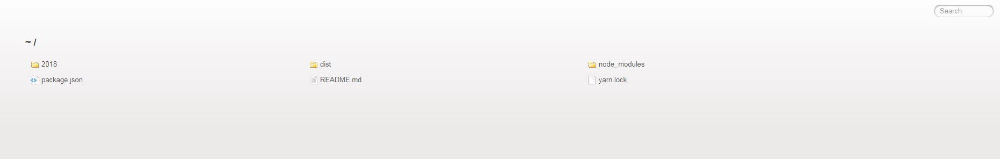

# VSCode插件

## project Manager

多项目管理

- `Ctrl`+`Shift`+`p`打开命令面板
  - `Edit Projects`初始化
  - `Save Projects`项目下运行，保存项目

## Bookmarks

对文件的行做标签（查看业务源码特别好用）

## Auto Close Tag

自动添加HTML / XML关闭标签

## Auto Rename Tag

自动重命名配对的HTML / XML标签

## Beautify

格式化javascript，JSON，CSS，Sass，和HTML

## Bracket Pair Colorizer

颜色识别匹配括号

## filesize

在底部状态栏显示当前文件大小，点击后还可以看到详细创建、修改时间

## HTML CSS Support

在 html 标签上写class 智能提示当前项目所支持的样式

## HTML Snippets

html 代码片段

## htmltagwrap

可以在选中HTML标签中外面套一层标签，选择一大段代码，然后按“`Alt` + `W`”

## Indenticator

突出目前的缩进深度

## JavaScript Snippet Pack

js代码片段

## JavaScript (ES6) code snippets

es6代码片段

## Live Server

静态服务器



## Live Sass Compiler

实时编译 sass ,不过需要配置（基于 Live Server）

```js
"liveSassCompile.settings.formats":[
  // You can add more
  {
    "format": "compressed",// 压缩格式
    "extensionName": ".min.css",// 编译后缀名
    "savePath": "./css"// 编译保存的路径
  }
],
"liveSassCompile.settings.autoprefix": [
  // 自动加前缀的目标浏览器
  "> 1%",
  "last 2 versions",
  "not ie <= 8"
],
```


## npm Intellisense

在导入语句中自动填充npm模块

## Path Intellisense

路径自动补全（必备）

## vscode-icons

目录树图标

## Chinese (Simplified) Language Pack for Visual Studio Code

中文包

## Code Spell Checker

对camelCase代码进行拼写检查

## REST Client

`REST`客户端允许直接发送`http`请求并在vsCode中查看相应

## SVG Viewer

查看SVG

## Color Info

查看颜色的（HEX、 RGB、HSL 和 CMYK）相关信息

## Minify

压缩

## Import Cost

计算引入包大小

## change-case

对变量的编写方式做调整（camel、constant、dot等）

## DotENV

.env配置文件的着色插件

## EditorConfig for VS Code

保持拥有.editorConfig的项目，不同编辑器统一格式的神器

## TODO Highlight

对 TODO: 进行特殊着色，配置一番后可对你配置的文字片段做特殊着色，神器