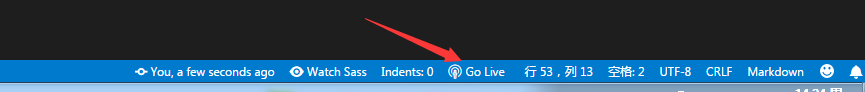

# VSCode 插件

## 通用

### 编辑器相关

- `Chinese (Simplified) Language Pack for Visual Studio Code`: 官方中文包
- `Settings Sync`: 使用 GitHub 保存 VSCode 的设置，设置可跨设备
- `filesize`: 在底部状态栏显示当前文件大小，点击后还可以看到详细创建、修改时间
- `Path Intellisense`: 路径自动补全
- `TODO Highlight`: 默认对 TODO: 进行特殊着色，可自定义配置的文字片段做特殊着色
- `Comment Translate`: 一个可以翻译注释的插件
- `GitLens — Git supercharged`: git 增强
- `EditorConfig for VS Code`: 根据 .editorConfig 文件统一编辑器的格式
- `Live Server`: 静态服务器
  
  
- [`Excel Viewer`](https://marketplace.visualstudio.com/items?itemName=GrapeCity.gc-excelviewer): 查看 `Excel`

### 项目管理

- `project Manager`: 多项目管理
- `Bookmarks`: 对文件的行做标签（查看业务源码特别好用）

### 代码相关

- `Code Runner`: 运行代码，可运行 JS, C, C++, Java, PHP 等
- `Code Spell Checker`: 对camelCase代码进行拼写检查
- `change-case`: 对变量的编写方式做调整（camel、constant、dot等）
- `REST Client`: `REST`客户端允许直接发送`http`请求并在 VSCode 中查看响应
- `Color Info`: 查看颜色的（HEX、 RGB、HSL 和 CMYK）相关信息

### 图片

- `Image preview`: 本地图片预览，在引入图片的行的左侧会出现图片的缩略图，鼠标悬停在图片的链接上会有图片预览
- `SVG Viewer`: 查看SVG

### 目录树图标

- `vscode-icons`
- `Material Icon Theme`

## 格式化

- `Beautify`: 格式化 `javascript`, `JSON`, `CSS`, `Sass`, `HTML`
- `Prettier - Code formatter`: 可以和 `ESLint` , `.editorConfig` 一起用的格式化插件，对 `.vue` 特别好用

## HTML

- `Auto Rename Tag`: 自动重命名配对的 HTML / XML 标签
- `HTML CSS Support`: 在 html 标签上写 class 智能提示当前项目所支持的样式
- `HTML Snippets`: html 代码片段
- `htmltagwrap`: 可以在选中HTML标签中外面套一层标签，选择一大段代码，然后按 `Alt` + `W`

## CSS

- `stylelint`: CSS/SCSS/Less 的代码规范性检查
- `Live Sass Compiler`:实时编译 `sass`

  ```json
  // VScode 配置文件中配置
  "liveSassCompile.settings.formats":[
    {
      "format": "compressed",// 压缩格式
      "extensionName": ".min.css",// 编译后缀名
      "savePath": "./css"// 编译保存的路径
    }
  ],
  "liveSassCompile.settings.autoprefix": [
    // 自动加前缀的目标浏览器
    "> 1%",
    "last 2 versions",
    "not ie <= 8"
  ],
  ```

  
- `Sass`:对 `.sass` 文件着色的插件
- `language-stylus`: `stylus` 预编译器的代码着色插件
- `Manta's Stylus Supremacy`: `stylus` 预编译器的代码格式插件

## JS

- `ESLint`: js 的代码规范性检查，可设置自动格式化

  ```json
  // VScode 配置文件中配置
  "eslint.autoFixOnSave": true, // 自动格式化
  "eslint.validate": [
    { "language": "javascript", "autoFix": true },
    { "language": "vue", "autoFix": true }
  ],
  ```

- `Visual Studio IntelliCode - Preview`: 微软官方出品的 AI 智能提示插件
- `JavaScript Snippet Pack`: js代码片段
- `JavaScript (ES6) code snippets`: es6代码片段
- npm相关:
  - `Import Cost`: 计算引入包大小
  - `npm Intellisense`: 在导入语句中自动填充npm模块
- `DotENV`: `.env` 配置文件的着色插件

## 我的 VSCode 设置

```json
{
  "workbench.iconTheme": "material-icon-theme",
  "workbench.statusBar.feedback.visible": false,
  "git.enableSmartCommit": true,
  "git.confirmSync": false,
  "emmet.triggerExpansionOnTab": true,
  "emmet.showSuggestionsAsSnippets": true,
  "editor.tabSize": 2,
  "editor.wordWrap": "on",
  "editor.renderWhitespace": "all",
  "editor.smoothScrolling": true,
  "editor.suggestSelection": "first",
  "files.eol": "\n",
  "files.autoSave": "onFocusChange",
  "files.defaultLanguage": "javascript",
  "files.associations": {
    "*.env.*": "dotenv"
  },
  "javascript.updateImportsOnFileMove.enabled": "always",

  "eslint.autoFixOnSave": true,
  "eslint.validate": [
    { "language": "javascript", "autoFix": true },
    { "language": "vue", "autoFix": true }
  ],

  "languageStylus.useSeparator": false,
  "stylusSupremacy.insertColons": false,
  "stylusSupremacy.insertSemicolons": false,
  "stylusSupremacy.insertBraces": false,
  "stylusSupremacy.insertNewLineAroundBlocks": false,

  "prettier.eslintIntegration": true,
  "prettier.htmlWhitespaceSensitivity": "ignore",

  "vetur.validation.template": false,

  "todohighlight.include": [
    "**/*.js",
    "**/*.jsx",
    "**/*.ts",
    "**/*.tsx",
    "**/*.html",
    "**/*.css",
    "**/*.scss",
    "**/*.styl",
    "**/*.vue"
  ],
  "todohighlight.keywords": [
    {
      "text": "@todo",
      "color": "#ffffff",
      "backgroundColor": "#FFBD2A"
    },
    {
      "text": "tips:",
      "color": "#130000",
      "backgroundColor": "#0DBC79"
    },
    {
      "text": "WRAN:",
      "color": "#964700",
      "backgroundColor": "#E5E510"
    },
    {
      "text": "DANGER:",
      "color": "#FF0000",
      "backgroundColor": "#FFB5B5"
    },
    {
      "text": "===start===",
      "color": "#130000",
      "backgroundColor": "#2472C8"
    },
    {
      "text": "===end===",
      "color": "#130000",
      "backgroundColor": "#2472C8"
    }
  ],

  "gitlens.views.lineHistory.enabled": false,
  "gitlens.views.search.enabled": false,

  "path-intellisense.extensionOnImport": true,
  "path-intellisense.mappings": {
    "@": "${workspaceRoot}/src"
  },

  "sync.gist": "**********************************",

  "vsintellicode.modify.editor.suggestSelection": "automaticallyOverrodeDefaultValue",

  "liveServer.settings.donotShowInfoMsg": true,
  "liveSassCompile.settings.formats":[
    {
      "format": "compressed",
      "extensionName": ".min.css",
    }
  ],
  "liveSassCompile.settings.autoprefix": [
    "> 1%",
    "last 2 versions",
    "not ie <= 8"
  ],

  "material-icon-theme.folders.associations": {
    "styl": "stylus",
    "iconfont": "font",
    "store": "dataBase",
    ".env.*": "dotenv"
  }
}

```